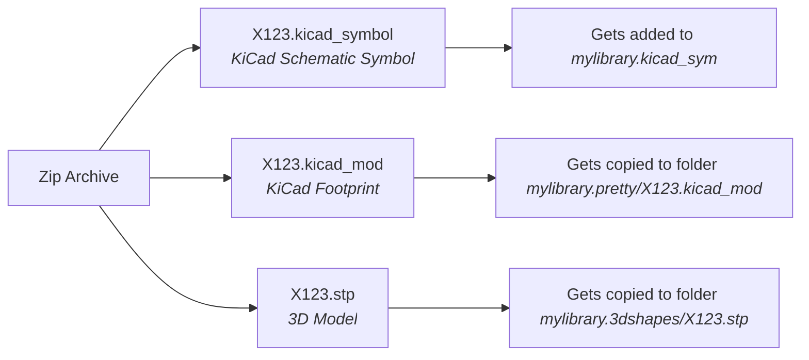
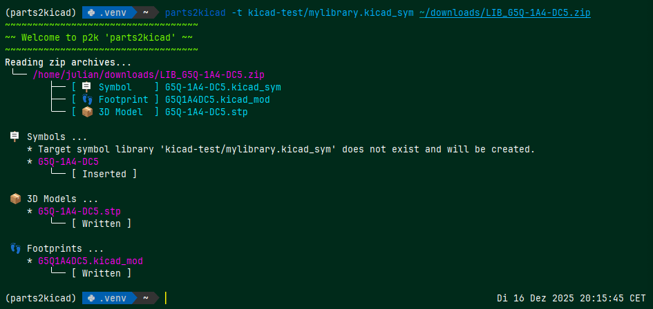
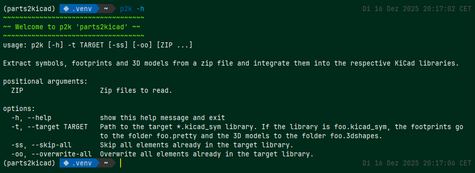

# parts2kicad

Extracts KiCad symbols, footprints and 3D models from SamacSys partlib zip files as you download them for instance via Mouser or Farnell.

This is done as follows:

So that you can keep all your downloaded stuff together at one place and do not have to fiddle inside the symbol libraries by yourself. 
The path to the 3D model in the footprint file is set to a relative path of the form `../mylibrary.3dshapes/X123.stp`. 
Thus, you can move your lib freely around your hard drive. Only if you rename it, the links from footprint to 3D model break.

The script is mainly intended for non Windows users (the official downloading tool only runs on Windows) and those who prefer command line over graphical UI.

## Installation

So far via PyPi: `pip install parts2kicad`.

## Usage

Usage is as easy as typing 
```bash
$ p2k some.zip -t mylibrary.kicad_sym
```
You can also glob over a bunch of zip archives:
```bash
$ p2k ~/downloads/*.zip -t mylibrary.kicad_sym
```

## Screenshots




## Project Pages

* [GitHub](https://github.com/julianschick/parts2kicad)
* [PyPi](https://pypi.org/project/parts2kicad/)

## Technical Background

All in all the main ingredient is a whitespace aware S-Expression parser. It is needed
for adding Symbols to the `.kicad_sym` library files without destroying the format.
The format is normally (and also by KiCad specification) nicely indented, so
that manual editing is also possible. Footprints and 3D models are luckily
managed on file level.
